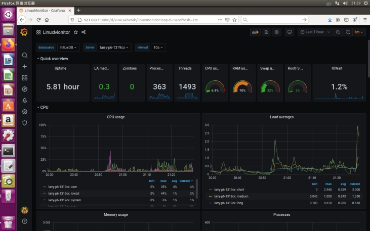
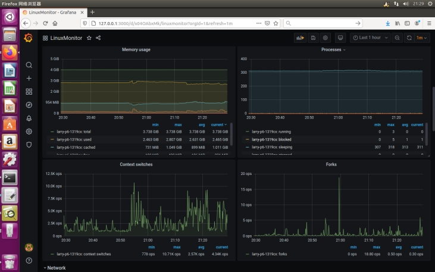
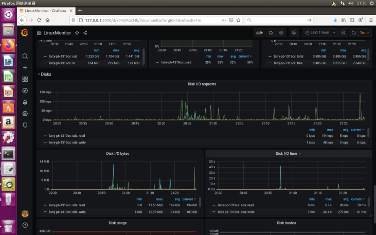
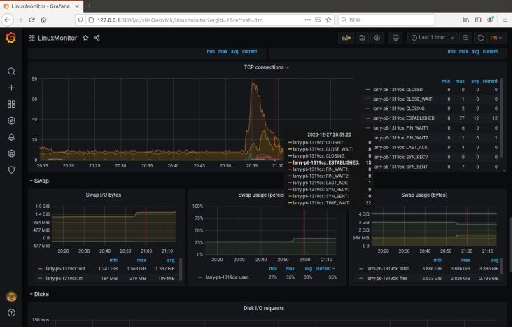
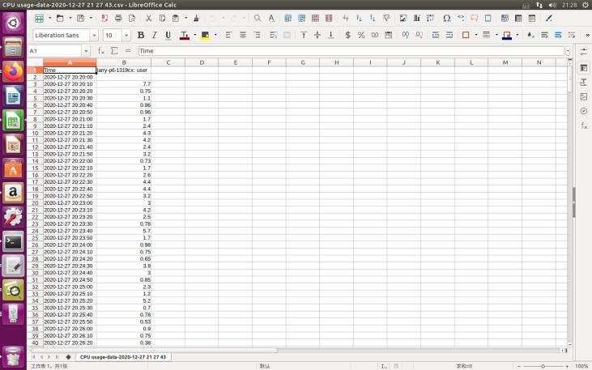

# LinuxMonitor——性能监测器java程序

## 1、介绍

LinuxMonitor基于java实现linux性能监测功能，监测数据包括CPU使用率、内存使用率、磁盘占用情况、网速等。实现思路是通过读取/proc下的特定编码文件来获取CPU运行情况、中断情况、启动时间、上下文切换次数、运行中的集成等信息。

## 2、相关技术

在Docker环境中基于Telegraf、Influxdb、Grafana等现有技术实现linux系统性能监控功能。其中InfluxDB（时序数据库）常用于监控数据统计，Telegraf可视为指标收集器用于将指标写入InfluxDB或其他输出的代理，而grafana用作监控页面的前端展示。

## 3、核心代码介绍

\LinuxMonitor\src文件夹中包括java文件

    --CpuUsage.java  计算cpu利用率
    
    --IoUsage.java     计算磁盘占用率
    
    --MemUsage.java 计算内存占用率
    
    --NetUsage.java    计算网速

## 4、图形界面搭建流程

1. 配置Docker环境；
2. 安装Influxdb数据库；
3. 安装Telegraf，配置输入流与输出流，输出流为influxdb，输入流为cpu，mem,net,disk,http,mysql,http_response,process；
4. 配置grafana同时分配端口；
5. 为Influxdb、Telegraf、grafana各建立容器,并构建容器间通信的连接

   系统图形界面如下图所示：

​																						图1 linux系统性能监控图形界面

​																						图2 内存使用情况监测界面

​																						图3 磁盘占用医疗情况监测界面

​																							图4 网络连接情况监测界面

​																				图5 本地下载的 CPU利用率数据表格		

