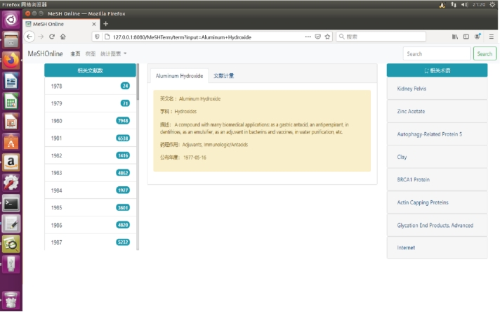

# MeSHOnline

## 1、项目介绍

MeSHOnline是一个生物热点可视分析web应用，这是一个基于Java和web技术的可视化前端系统. 以MeSH词条数据库为支撑，MeSHOnline可为用户提供术语信息浏览、术语关联分析、文献总量分析、热点信息探索等功能. 

## 2、应用部署流程

1. 安装tomcat，配置端口；
2. 安装mysql数据库，同时导入数据表；
3. 将web应用导出为war包，部署至tomcat中；
4. 修改tomcat中对外部包依赖以及mysq连接设置；
5. 开启tomcat；

3、图形界面展示

请观看以下演示视频：

图1 MeSHOnline信息检索页面

图2 MeSHOnline信息概览页面